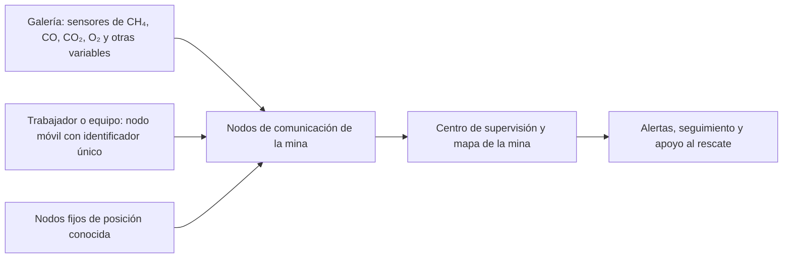
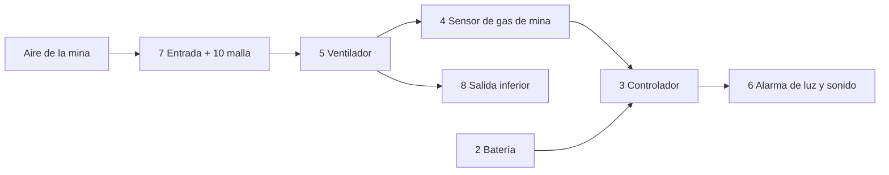
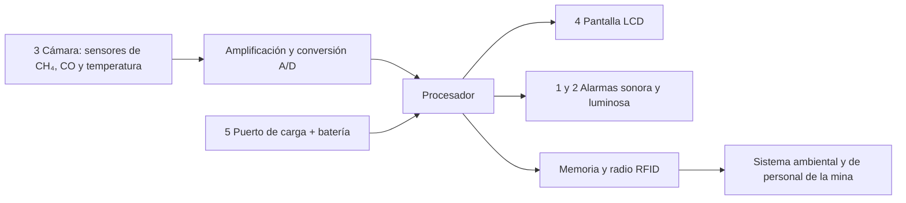

# Taller 4 — Búsqueda y revisión de patentes

## Alcance de la revisión

Se comparan tecnologías relacionadas con la **medición de gases, la alerta al trabajador y el seguimiento de personal en minas subterráneas**. La patente 3 de la versión inicial (CN111441817B) describía fracturación y drenaje del gas del manto de carbón; se reemplaza porque no aborda directamente la vigilancia del ambiente que respira el trabajador ni su alerta personal. Las tres soluciones seleccionadas cumplen funciones distintas y complementarias.

Los detalles técnicos siguientes proceden de las descripciones y reivindicaciones de las publicaciones citadas. Cuando una publicación no indica un dato cuantitativo, se señala expresamente; no se asume que el desempeño anunciado haya sido verificado en campo.

**Procedencia del contenido:** las fichas de cada dispositivo resumen lo declarado en las patentes enlazadas. Las cadenas de búsqueda de las patentes 1 y 2 se conservaron del archivo entregado inicialmente; los diagramas, la selección de la patente 3 y las columnas «Relación con el proyecto» o «Aporte» son análisis elaborados para este taller y se identifican como tales. Las traducciones de las patentes chinas y sus datos de publicación se consultaron en Google Patents.

## Patente 1: CN105781618A — Sistema integral de seguridad para minas de carbón basado en Internet de las Cosas

**Búsqueda empleada en la versión inicial:** `ctxt = "mining" AND ctxt = "underground" AND (ctxt = "purify air" OR ctxt = "oxygen" OR ctxt = "mitigate gases") AND (ntxt all "sensor" OR ntxt all "parameters") AND (ctxt all "staff safety" OR ctxt all "security" OR ctxt all "miner") AND (ctxt = "mechanic" OR ctxt = "IoT" OR ctxt = "portable" OR ctxt = "alert") AND (ctxt = "metano" OR ctxt = "carbon monoxide" OR ctxt = "carbon dioxide")`

**Fuente:** [CN105781618A, descripción y reivindicaciones 1 a 4](https://patents.google.com/patent/CN105781618A/en). **Titular:** Huayang Communication Technology Co. Ltd. **Inventores:** Sheng Wenyan, Kong Mingkun, Li Yong y Du Haiyang. **Clasificación IPC:** E21F17/18. **Prioridad:** 15 de marzo de 2016. **Publicación:** 20 de julio de 2016.

### Funcionamiento y detalles técnicos

| Elemento | Qué especifica la patente | Relación con el proyecto |
|---|---|---|
| Vigilancia ambiental | Sensores en las galerías para **metano (CH₄), monóxido de carbono (CO), dióxido de carbono (CO₂) y concentración de oxígeno (O₂)**. También menciona presión del techo, nivel de agua, incendio, velocidad y presión del aire, temperatura, humedad y humo. | Identifica variables concretas del ambiente subterráneo que pueden alimentar avisos de riesgo. |
| Red de comunicación | Nodos fijos en galerías, nodos de monitoreo ambiental, nodos de equipos y nodos móviles llevados por trabajadores o vehículos. La patente contempla RFID, ZigBee o red de fibra óptica para comunicar los nodos. | Permite reunir mediciones distribuidas en un centro de supervisión. |
| Posicionamiento | Cada objeto móvil lleva un nodo con identificador único. Los nodos móviles se comunican con **nodos de referencia de posición conocida** instalados a lo largo de la galería; la conectividad o la información de distancia/señal permite estimar la ubicación y enviar el resultado a superficie. | Ayuda a localizar trabajadores, seguir recorridos y conocer su distribución durante una emergencia. **No se trata de posicionamiento por GPS subterráneo.** |
| Respuesta | El sistema de supervisión puede emitir alertas; la descripción contempla desconectar la energía de un área y activar ventilación cuando se detectan condiciones anómalas. | Conecta la detección con acciones de seguridad. |

**Límite de lo divulgado:** el documento enumera los sensores y explica la arquitectura de localización, pero no fija en las reivindicaciones consultadas rangos de medición, umbrales numéricos, precisión de posición ni autonomía de los nodos.

### Traducción de las figuras y de sus partes

La [publicación original](https://patents.google.com/patent/CN105781618A/en) denomina sus figuras así: **figura 1**, estructura de la red IoT; **figura 2**, subsistemas del monitoreo integral; **figura 3**, sistema de información geográfica de la mina; **figura 4**, comunicación por voz. El siguiente esquema explica en español la relación funcional representada; es una **síntesis de la descripción**, no una reproducción literal del dibujo de patente.

**Lectura de la figura 3:** el mapa reúne la ubicación de galerías, equipos, sensores y personal. **Lectura de la figura 4:** el nodo llevado por el trabajador incorpora micrófono y receptor para establecer comunicación de voz. [Descripción de las figuras y del posicionamiento](https://patents.google.com/patent/CN105781618A/en).

## Patente 2: CN209163870U — Dispositivo automático de alarma de gas de mina para minas de carbón

**Búsqueda empleada en la versión inicial:** `ctxt = "underground" AND ctxt = "mine" AND ctxt = "gas" AND ta = "sensor" AND cl = "E21F17/18"`

**Fuente:** [CN209163870U, descripción, figuras y reivindicaciones](https://patents.google.com/patent/CN209163870U/en). **Titular:** Guizhou Yuneng Investment Co. Ltd. **Inventores:** Hu Hongyin y Lei Yong. **Clasificación IPC:** E21F17/18. **Prioridad:** 12 de octubre de 2018. **Publicación:** 26 de julio de 2019.

### Funcionamiento y detalles técnicos

La publicación usa el término chino **瓦斯 (*gas de mina*)** para lo que detecta el sensor. La traducción inglesa de los antecedentes lo relaciona con **metano (CH₄)**, pero las reivindicaciones no especifican la composición del gas ni la selectividad del sensor. El dispositivo tampoco declara medir CO, CO₂ u O₂. Un ventilador aspira aire de la mina por una entrada protegida con malla, lo hace pasar frente al sensor de concentración y lo expulsa por un orificio inferior. El controlador compara la lectura con un valor de alarma configurado mediante el botón y activa una señal **sonora y luminosa** cuando se alcanza ese valor. [Texto original y traducción de la patente](https://patents.google.com/patent/CN209163870U/zh).

| Elemento | Dato concreto publicado | Aporte |
|---|---|---|
| Alimentación | Compartimento de batería con tapa desmontable; alimenta controlador, sensor, ventilador y alarma. | Puede funcionar sin un cable fijo durante el uso. |
| Transporte | Carcasa que reúne los componentes y **presilla de fijación** en el exterior. La descripción indica que se pasa un cinturón o cuerda por la presilla para sujetarlo a la cintura. | Explica físicamente la portabilidad, más allá de calificarlo como “pequeño”. |
| Muestreo | Entrada lateral con malla contra polvo, ventilador frente a la entrada, sensor frente al ventilador y salida inferior. | Dirige una corriente de aire hacia el sensor. |
| Advertencia | Controlador y alarma acústica y óptica conectados al sensor. | Avisa localmente al portador cuando se supera el valor configurado. |

**Límite de lo divulgado:** no se proporcionan dimensiones, masa, duración de la batería, rango del sensor ni valor numérico del umbral. Por ello no es posible cuantificar su comodidad de transporte ni comparar su autonomía con la de otros equipos.

### Traducción de las partes numeradas de las figuras 1 a 5

Las [figuras originales de CN209163870U](https://patents.google.com/patent/CN209163870U/en) muestran vistas frontal, izquierda, derecha, superior e inferior del mismo dispositivo. La numeración indicada en la descripción significa:

| N.º | Parte en español | Función |
|---|---|---|
| 1 | Carcasa de plástico transparente | Aloja los componentes. |
| 2 | Compartimento de batería | Contiene la fuente de energía. |
| 3 | Controlador | Procesa la lectura y ordena la alarma. |
| 4 | Sensor de concentración de gas de mina | Mide el gas de mina que llega al interior; la patente no especifica su selectividad química. |
| 5 | Ventilador | Impulsa la muestra de aire. |
| 6 | Alarma acústica y óptica | Emite sonido y luz de advertencia. |
| 7 | Entrada de aire | Permite que entre la muestra. |
| 8 | Salida de aire | Deja salir la muestra por la parte inferior. |
| 9 | Botón de operación | Enciende y permite configurar el controlador. |
| 10 | Malla filtrante | Retiene partículas en la entrada. |
| 11 | Tapa del compartimento de batería | Permite cambiar la batería. |
| 12 | Presilla de fijación | Permite pasar un cinturón o cuerda para sujetar el equipo a la cintura. |

## Patente 3: CN203489910U — Detector portátil inalámbrico de varios parámetros y apoyo a búsqueda y rescate

**Fuente:** [CN203489910U, descripción, figuras y reivindicaciones](https://patents.google.com/patent/CN203489910U/en). **Titular:** Jiangxi Huihong Information Technology Co. Ltd. **Inventor:** Liang Zirong. **Prioridad:** 19 de agosto de 2013. **Publicación:** 19 de marzo de 2014.

### Por qué es relevante y cómo funciona

Esta publicación reúne en un aparato llevado por el trabajador la **detección de metano (CH₄), monóxido de carbono (CO) y temperatura**, una alarma local y la transmisión inalámbrica de lecturas e identificadores hacia los sistemas de vigilancia ambiental y ubicación de personal de la mina. Por eso se relaciona directamente con la exposición del trabajador a gases y con la respuesta ante incidentes. **No describe purificación del aire ni suministro de oxígeno.** [Resumen y reivindicaciones](https://patents.google.com/patent/CN203489910U/en).

| Elemento | Dato técnico publicado | Aporte |
|---|---|---|
| Cabezal de detección | Elementos sensores separados para CH₄, CO y temperatura, integrados en una cámara de muestra multiparámetro. Sus señales pasan por amplificación y conversión analógico-digital al procesador. | Proporciona tres variables concretas en un solo instrumento. |
| Procesamiento y aviso | Procesador, pantalla LCD, almacenamiento y alarma sonora y luminosa. | Presenta las lecturas al portador y advierte condiciones configuradas como alarma. |
| Comunicación | Circuito de radiofrecuencia/RFID que recibe identificadores de tarjetas personales y transmite lecturas e identificadores a equipos de recolección o lectores de la mina. | Vincula datos ambientales y datos de personal para vigilancia y búsqueda. |
| Construcción y energía | Carcasa moldeada en PVC descrita con pared de **1,5 mm**, unión de tapas con junta tórica, batería recargable y autonomía declarada de **hasta 12 horas de funcionamiento continuo**. | Da sustento técnico a la portabilidad anunciada; la autonomía es la declarada por la patente. |

**Límite de lo divulgado:** esta publicación no mide O₂ ni CO₂ y no demuestra que pueda sustituir los equipos de protección respiratoria. La “ubicación” depende de la infraestructura de lectura y comunicación de la mina; el aparato no declara coordenadas GPS.

### Traducción de las figuras y sus componentes

La **figura 1** de la [publicación original](https://patents.google.com/patent/CN203489910U/en) presenta el exterior del instrumento. Sus números corresponden a:

| N.º | Parte en español | Función |
|---|---|---|
| 1 | Ventana de alarma sonora | Deja percibir el aviso acústico. |
| 2 | Ventana de luz de alarma | Muestra el aviso visual. |
| 3 | Cámara de aire multiparámetro | Aloja la zona donde los sensores entran en contacto con la muestra. |
| 4 | Pantalla LCD | Muestra lecturas, datos de tarjeta y estado de batería. |
| 5 | Puerto de carga | Permite recargar el instrumento. |
| 6 | Cuatro botones multifunción | Encendido, consulta y configuración. |
| 7 | Panel de PVC | Parte frontal de protección y soporte. |

La **figura 2** es un diagrama del circuito. Se interpreta de izquierda a derecha como sensores de CH₄/CO/temperatura → acondicionamiento y conversión de señal → procesador → pantalla, memoria, alarma y radio. La batería alimenta estos bloques mediante circuitos de carga y regulación.

## Comparación para el proyecto

| Aspecto | CN105781618A | CN209163870U | CN203489910U |
|---|---|---|---|
| Escala | Red de toda la mina | Alarma local llevada a la cintura | Instrumento personal conectado a sistemas de la mina |
| Variables ambientales especificadas | CH₄, CO, CO₂, O₂, humo, temperatura, humedad y otras | Gas de mina (瓦斯); composición y selectividad del sensor no especificadas | CH₄, CO y temperatura |
| Localización de personas | Nodos móviles frente a nodos fijos de referencia | No descrita | Identificadores y comunicación con infraestructura de ubicación |
| Aviso | Alertas y acciones desde la supervisión | Sonido y luz en el dispositivo | Sonido y luz en el instrumento |
| Dato útil para diseño | Selección de variables y arquitectura de red | Ruta de muestra, fijación y alarma personal | Integración de varios sensores y transmisión en un aparato portable |
| Límite principal | No cuantifica precisión de localización ni umbrales | No especifica selectividad química del sensor ni cuantifica peso/autonomía | No mide O₂/CO₂ ni purifica aire |

**Conclusión:** las tres patentes informan decisiones de diseño sobre **qué medir, cómo avisar y cómo relacionar la lectura con el trabajador y su ubicación**. Ninguna acredita por sí sola la eficacia de una solución de purificación o respiración; esa función requeriría una búsqueda de patentes específica.

