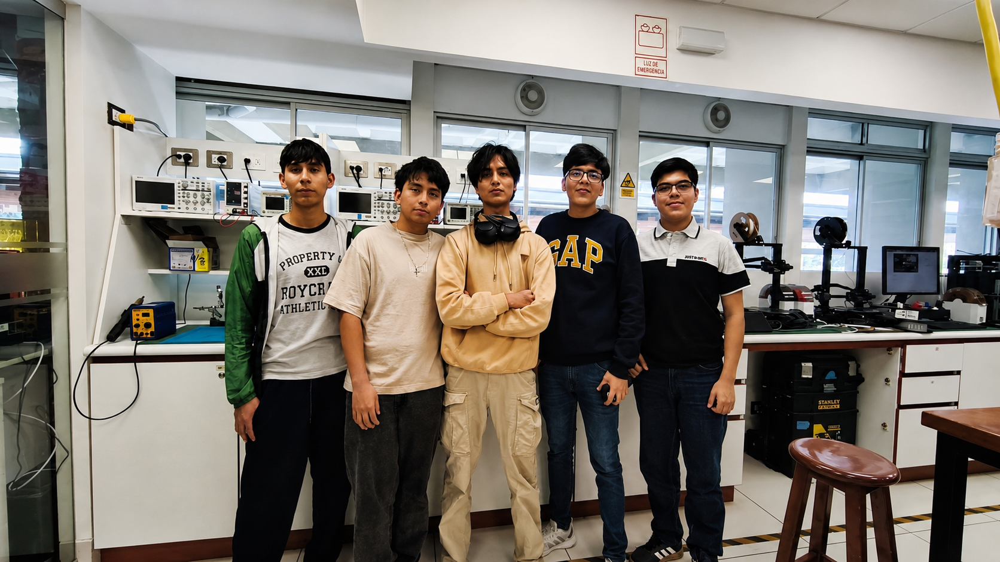

# Equipo 05 - Fundamentos de diseño
### Carrera de Ingeniería Informática / Industrial  
**Universidad Peruana Cayetano Heredia**

---

## 🌍 Descripción del Equipo 
Somos el **Equipo 05** del curso **Fundamentos de diseño 2026-2**, conformado por estudiantes de la carrera de Informática / Industrial.  
Nuestro objetivo es aplicar la metodología de diseño para generar soluciones innovadoras con impacto social, tecnológico y ambiental.  

Nos interesa trabajar en los siguientes **Objetivos de Desarrollo Sostenible (ODS):**  
- ODS 3: Salud y Bienestar  
- ODS 6: Agua Limpia y Saneamiento  
- ODS 9: Industria, Innovación e Infraestructura  
- ODS 11: Ciudades y Comunidades Sostenibles  
- ODS 13: Acción por el Clima

---

## 📸 Fotografía del Equipo  

  <em>Figura 1. Fotografía del equipo 0X</em>

---

## 👥 Integrantes del Equipo  

| Foto | Nombre | Rol | Intereses |
|------|--------|-----|-----------|
|  | **Nombre 1** | Líder del equipo | Innovación social, sostenibilidad |
|  | **Gonzalo** | Responsable de investigación | Gestión ambiental, desarrollo comunitario |
|  | **Nombre 3** | Diseñador/a | Diseño de prototipos, creatividad aplicada |
|  | **Nombre 4** | Encargado/a de documentación | Comunicación científica, redacción técnica |
|  | **Nombre 5** | Programador/a - Modelador/a | Programación, análisis de datos, simulación |

---

## 📌 Resumen Final  
Este README resume quiénes somos, qué nos motiva y en qué ODS queremos enfocar nuestro trabajo durante todo el curso.  
